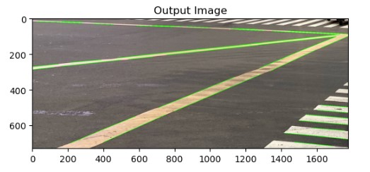
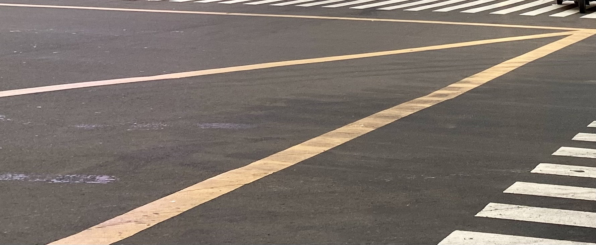
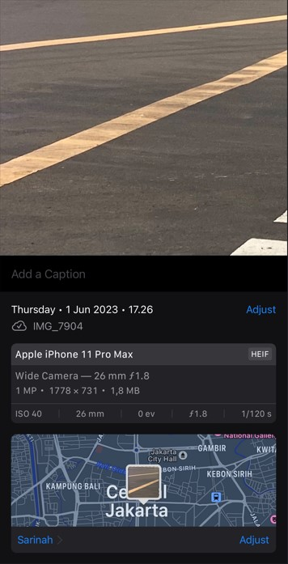

# Deteksi Marka Jalan

Muhammad Fadhil Rizki Perdana - 202131184

## Teori
Pengolahan Citra (Image Processing) adalah suatu bidang dalam ilmu komputer dan teknik yang berfokus pada analisis, pemrosesan, dan manipulasi gambar atau citra digital. Tujuan dari pengolahan citra adalah untuk mengubah citra menjadi bentuk yang lebih bermakna, meningkatkan kualitasnya, atau mengekstrak informasi penting dari citra tersebut. Pengolahan citra juga merupakan bidang yang luas dengan banyak teknik dan metode yang berbeda untuk memproses dan menganalisis citra.

Pengolahan citra memiliki banyak aplikasi dalam berbagai bidang, termasuk pengenalan pola, penglihatan komputer, kedokteran, survei tanah, robotika, dan banyak lagi. Dengan kemajuan teknologi dan kecerdasan buatan, pengolahan citra semakin penting dalam berbagai aplikasi dan industri modern.

Contoh penerapan dari ilmu Pengolahan Citra yakni :

- Deteksi Plat Nomor Kendaraan
- Deteksi Objek
- Lane Detection (Deteksi Marka Jalan)
- Parking Mark Detection (Deteksi Marka Parkir)
- Word Segmentation
- Background Removal

Penerapan ini cukup umum digunakan saat ini seperti CCTV yang digunakan untuk mendeteksi plat nomor kendaraan yang melanggar lalu lintas, atau mobil memiliki fitur Lane Keeping Assist yang menggunakan sensor untuk mendeteksi marka jalan, dan mobil yang memiliki fitur untuk parkir sendiri secara otomatis. 

Sehubungan dengan hal ini, salah satu aplikasi dalam pengolahan citra yang sudah kita sebutkan sebelumnya ialah Lane Detection (Deteksi Marka Jalan). Deteksi marka jalan merupakan proses identifikasi dan pengenalan marka jalan yang ada pada citra atau video. Marka jalan adalah tanda-tanda yang diberikan di permukaan jalan untuk membantu pengendara kendaraan mengikuti jalur yang benar, memberikan batasan jalan, atau memberikan informasi lainnya.

Deteksi marka jalan dalam pengolahan citra melibatkan ekstraksi fitur-fitur yang relevan dari marka jalan untuk mengklasifikasikannya ke dalam kategori yang sesuai. Beberapa fitur yang umumnya digunakan dalam deteksi marka jalan adalah sebagai berikut:

1. **Fitur Geometri**: Fitur-fitur geometri digunakan untuk menggambarkan bentuk dan ukuran marka jalan. Beberapa fitur geometri yang umum digunakan termasuk panjang marka jalan, lebar marka jalan, luas marka jalan, orientasi marka jalan, atau rasio aspek (aspect ratio) marka jalan.

2. **Fitur Warna**: Fitur-fitur warna digunakan untuk menggambarkan karakteristik warna marka jalan. Fitur-fitur ini dapat mencakup nilai intensitas warna, histogram warna, atau distribusi warna pada marka jalan.

3. **Fitur Tekstur**: Fitur-fitur tekstur menggambarkan pola atau tekstur yang ada pada marka jalan. Beberapa metode ekstraksi fitur tekstur yang umum digunakan adalah menggunakan matriks ko-occurance (co-occurrence matrix), transformasi wavelet, atau histogram tekstur.

4. **Fitur Tepi**: Fitur tepi digunakan untuk mengidentifikasi tepi marka jalan yang dapat membantu dalam deteksi. Fitur-fitur tepi ini dapat diekstraksi menggunakan operator deteksi tepi seperti operator Sobel, Prewitt, atau Canny.

5. **Fitur Skala**: Fitur-fitur skala digunakan untuk menggambarkan variasi skala marka jalan yang dapat ditemukan dalam citra. Fitur ini penting karena marka jalan dapat memiliki lebar atau panjang yang bervariasi tergantung pada posisi dan perspektif pengambilan gambar.

6. **Fitur Konteks**: Fitur-fitur konteks menggambarkan informasi sekitar marka jalan yang dapat membantu dalam deteksi dan klasifikasi. Misalnya, fitur-fitur ini dapat mencakup jarak relatif ke objek lain, kepadatan marka jalan di sekitar area deteksi, atau perbandingan marka jalan dengan elemen lingkungan lainnya.

Pemilihan fitur yang tepat tergantung pada karakteristik marka jalan yang ingin dideteksi, serta kompleksitas dan variasi lingkungan jalan. Dalam beberapa kasus, kombinasi dari beberapa fitur tersebut dapat digunakan untuk meningkatkan akurasi deteksi marka jalan. Selain itu, penggunaan teknik pembelajaran mesin (machine learning) seperti jaringan saraf tiruan (neural networks) atau metode klasifikasi lainnya dapat membantu dalam ekstraksi fitur dan pengklasifikasian yang lebih akurat.

Dalam deteksi marka jalan, pengolahan citra memainkan peran penting dalam memproses, menganalisis, dan mengidentifikasi marka jalan pada citra. Teknik pengolahan citra dapat membantu meningkatkan akurasi dan efisiensi dalam deteksi marka jalan, serta dapat diterapkan dalam berbagai sistem kendaraan pintar, sistem bantu pengemudi, atau sistem transportasi cerdas untuk meningkatkan keselamatan jalan raya.


## Tahapan Penyelesaian Program

Proses deteksi marka jalan menggunakan teknik pengolahan citra untuk mengidentifikasi dan membedakan marka jalan dari latar belakang citra. Beberapa langkah yang umum dilakukan dalam deteksi marka jalan meliputi:

- Pre-processing: Citra awal memerlukan tahapan pre-processing untuk meningkatkan kualitas citra, menghilangkan noise, dan meningkatkan kontras antara marka jalan dan latar belakang.

- Segmentation: Langkah ini melibatkan pemisahan marka jalan dari latar belakang citra. Metode segmentasi yang umum digunakan meliputi segmentasi berdasarkan warna, intensitas, atau tekstur marka jalan.

- Feature Detection: Setelah Segmentation, fitur-fitur yang relevan diambil dari marka jalan yang terdeteksi. Fitur-fitur ini dapat meliputi panjang, lebar, bentuk, atau pola marka jalan.

- Clasification: Fitur-fitur yang telah diambil kemudian digunakan untuk mengklasifikasikan marka jalan menjadi kategori yang sesuai, misalnya marka jalan lurus, marka jalan putus-putus, atau marka jalan berbelok.

- Post-processing: Setelah tahap klasifikasi, langkah terakhir adalah post-processing. Ini melibatkan pengolahan lanjutan pada hasil deteksi untuk meningkatkan akurasi atau memperbaiki deteksi yang tidak akurat. Misalnya, penggabungan atau penyaringan spasial dapat digunakan untuk menghilangkan deteksi ganda atau mengisi celah yang mungkin terjadi dalam marka jalan.## Penjelasan Source Code
Untuk penjelasan source code saya akan membagi ke beberapa segmen agar dapat lebih mudah dipahami. Beberapa line dari source code digunakan berulang jadi dalam hal itu source code yang sama hanya akan dijelaskan satu kali

#### Importing Library

```bash
import cv2 as cv
import numpy as np
import matplotlib.pyplot as plt
```
Segmen ini adalah bagian untuk mengimport library yang dibutuhkan untuk menjalankan program. Library ini umum digunakan untuk pengolahan gambar.
+ **Line 1** : digunakan untuk mengimport library OpenCV dan diberikan variabel 'cv' ke library tersebut yang kedepannya akan diakses dalam program
+ **Line 2** : digunakan untuk mengimport library NumPy dan diberikan variabel 'np' ke library tersebut yang kedepannya akan diakses dalam program
+ **Line 3** : line ini mengimport modul 'pyplot' dari library matplotlib dan diberikan alias 'plt' ke modul tersebut yang kedepannya akan diakses dalam program

#### Read Image

```bash
img = cv.imread('marka-jalan.jpg')
cv.imshow("Marka Jalan", img)
cv.waitKey(0)
cv.destroyAllWindows()
```
Segmen ini berfungsi untuk membaca file dan menampilkan citra marka jalan yang nantinya akan diolah dalam program ini.
+ **Line 1** : line ini menggunakan fungsi imread dari OpenCV untuk membaca citra dengan nama file 'marka-jalan.jpg' dan menyimpannya ke variabel 'img'
+ **Line 2** : line ini menggunakan fungsi imshow dari OpenCV untuk menampilkan citra yang telah dibaca ke dalam pop-up window dengan judul "Marka Jalan".  
+ **Line 3** : line ini menggunakan fungsi waitKey dari OpenCV untuk menunggu pengguna menekan tombol pada keyboard.
+ **Line 4** : line ini menggunakan fungsi destroyAllWindows dari OpenCV untuk menutup semua jendela pop-up yang telah dibuka saat program berjalan.

#### Convert Image to Grayscale

```bash
gray = cv.cvtColor(img, cv.COLOR_BGR2GRAY)
plt.imshow(gray)
plt.show()
```
Segmen ini berfungsi untuk mengubah citra berwarna menjadi citra grayscale dan menampilkannya menggunakan 'matplotlib.pyplot'.
+ **Line 1** : line ini memakai fungsi cvtColor dari OpenCV untuk mengubah citra berwarna ('img') menjadi citra grayscale.
+ **Line 2** : line ini memakai  fungsi imshow dari matplotlib.pyplot untuk menampilkan citra grayscale ('gray'). 
+ **Line 3** : line ini memakai fungsi show dari matplotlib.pyplot untuk menampilkan citra yang telah ditampilkan sebelumnya menggunakan imshow

#### Applying Gaussian blur over Grayscale Image

```bash
blur = cv.GaussianBlur(gray, (5,5), 0)
plt.imshow(blur, cmap = 'gray')
plt.title('Gaussian Blur'), plt.xticks([]), plt.yticks([])
plt.show
```
Segmen ini berfungsi untuk menerapkan Gaussian blur pada citra grayscale dan menampilkannya menggunakan matplotlib.pyplot. 
+ **Line 1** : line ini memakai fungsi 'GaussianBlur' dari OpenCV untuk menerapkan Gaussian blur pada citra grayscale ('gray'). 
+ **Line 2** : line ini memakai fungsi 'imshow' dari 'matplotlib.pyplot'untuk menampilkan citra setelah diterapkan Gaussian blur ('blur').
+ **Line 3** : line ini memakai fungsi 'title' 'xticks', dan 'yticks' dari 'matplotlib.pyplot' untuk memberikan judul pada gambar dan menghilangkan penanda sumbu (ticks) pada sumbu x dan y.

#### Edge Detection using Canny

```bash
edges = cv.Canny(gray, 150, 300)
plt.imshow(edges, cmap = 'gray')
plt.title('Edges Image'), plt.xticks([]), plt.yticks([])
plt.show
```
Segmen ini berfungsi untuk mendeteksi tepi pada citra grayscale menggunakan metode Canny edge detection dan menampilkannya menggunakan 'matplotlib.pyplot'.
+ **Line 1** : line ini menggunakan fungsi Canny dari OpenCV untuk mendeteksi tepi pada citra grayscale (gray). Argumen 150 dan 300 adalah nilai ambang bawah dan ambang atas yang digunakan dalam proses deteksi tepi.


#### Lines Detection using Hugh Transformation

```bash
lines = cv.HoughLinesP(edges, 1, np.pi/180, threshold=100, minLineLength=100, maxLineGap=10)
```
Segmen ini berfungsi untuk mendeteksi garis-garis pada citra tepi menggunakan transformasi Hough (Hough transform) dengan metode Probabilistic Hough Transform dan menyimpan hasilnya dalam variabel 'lines'.
+ **Line 1** : line ini menggunakan fungsi HoughLinesP dari OpenCV untuk mendeteksi garis-garis pada citra tepi (edges) menggunakan Probabilistic Hough Transform.
 Berikut penjelasan dari setiap argumen dalam fungsi ini :
 - 'edges': Citra tepi yang telah diperoleh sebelumnya.
 - '1' : Resolusi rho dalam piksel pada transformasi Hough.
 - 'np.pi/180' : Resolusi theta dalam radian pada transformasi Hough.
 - 'threshold=100' : Ambang batas untuk mendeteksi garis.
 - 'minLineLength=100' : Panjang minimum garis yang akan diterima.
 - 'maxLineGap=10' : Jarak maksimum antara segmen garis yang masih dianggap sebagai bagian dari garis yang sama.
 
#### Drawing Lines to real Image

```bash
output_image = img.copy()
for line in lines:
    x1, y1, x2, y2 = line[0]
    cv.line(output_image, (x1, y1), (x2, y2), (0, 255, 20), 2)

plt.imshow(cv.cvtColor(output_image, cv.COLOR_BGR2RGB))
plt.title('Output Image')
plt.show()
```
Segmen ini berfungsi untuk menggambar garis-garis yang telah terdeteksi pada citra asli dan menampilkan citra output_image yang telah digambar garis-garis yang terdeteksi pada citra asli. 
+ **Line 1** : line ini membuat salinan citra asli ('img') menggunakan metode 'copy()'. Salinan ini akan digunakan untuk menggambar garis-garis yang terdeteksi tanpa mengubah citra asli.
+ **Line 2** : line memulai loop 'for' untuk mengiterasi setiap garis dalam variabel 'lines'
+ **Line 3** : line ini menguraikan koordinat titik awal dan akhir garis dari setiap elemen 'line' dalam variabel 'lines' menjadi variabel 'x1', 'y1', 'x2', dan 'y2'. Ini memungkinkan Anda untuk menggambar garis menggunakan koordinat ini.
+ **Line 4** : line menggunakan fungsi line dari OpenCV untuk menggambar garis pada citra output_image. Parameter pertama adalah citra di mana garis akan digambar. Parameter kedua dan ketiga adalah koordinat titik awal dan akhir garis. Parameter keempat adalah warna garis dalam format BGR (Blue-Green-Red), di sini (0, 255, 20) menunjukkan warna hijau. Parameter kelima adalah ketebalan garis.

---

## Hasil Output dan Detail gambar

+ **Output citra dari program**


+ **Citra Asli**


+ **Detail Citra**



